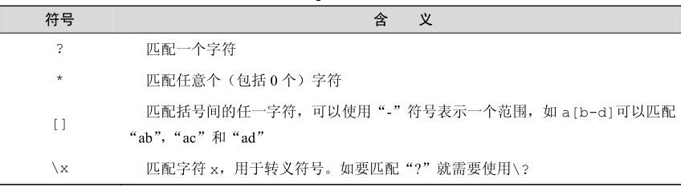

```
查看redis集群状态
redis-trib.rb check host:port

redis-trib.rb help

进入redis命令行

redis-cli -p localhost -h 7001 -a 3edc4RFV
查看redis集群状态
cluster nodes
cluster info
```

redis是通过docker安装的

##### 进入redis命令行

redis-cli（Redis Command Line Interface）是Redis自带的基于命令行的Redis客户端

```
➞docker exec -it redis redis-cli
>
```

**提示** redis命令不区分大小写

### 5 种基础数据结构

#### string（字符串）

Redis 所有的数据结构都以唯一的 key 字符串作为名称，然后通过这个唯一 key 值来获取相应的 value 数据。不同类型的数据结构的差异就在于 value 的结构不一样。

Redis 的字符串是动态字符串，是可以修改的字符串，内部结构的实现类似于Java 的 Array List，采用预分配冗余空间的方式来减少内存的频繁分配，当字符串长度小于1MB时，扩容都是加倍现有的空间。如果字符串长度超过1MB，扩容时一次只会多扩1MB的空间。需要注意的是字符串最大长度为512MB。

```redis
> set name codehole 
OK
> get name
"codehole"
> exists name
(integer) 1
> del name
(integer) 1
> get name
(nil)
```

可以对多个字符串进行批量读写，节省网络耗时开销。

```bash
> set name1 codehole
OK
> set name2 holecode
OK
> mget name1 name2 name3
1) "codehole"
2) "holecode"
3) (nil)
> mset name1 boy name2 girl name3 unknown
OK
> mget name1 name2 name3
1) "boy"
2) "girl"
3) "unknown"
```

过期和set命令扩展

### list（列表）

Redis 的列表相当于 Java 语言里面的 Linked List，注意它是链表而不是数组。这意味着 list 的插入和删除操作非常快，时间复杂度为 O（1），但是索引定位很慢，时间复杂度为 O（n）。


#### 获得符合规则的键名列表

#### `KEYS pattern`

注意⚠️KEYS命令需要遍历Redis中的所有键，当键的数量较多时会影响性能，不建议在生产环境中使用。

Redis的业务应用范围

1.记录帖子的点赞数、评论数和点击数（hash）。
2.记录用户的帖子 ID 列表（排序），便于快速显示用户的帖子列表（zset）。
3.记录帖子的标题、摘要、作者和封面信息，用于列表页展示（hash）。
4.记录帖子的点赞用户 ID 列表，评论 ID 列表，用于显示和去重计数（zset）。
5.缓存近期热帖内容（帖子内容的空间占用比较大），减少数据库压力（hash）。
6.记录帖子的相关文章 ID，根据内容推荐相关帖子（list）。
7.如果帖子 ID 是整数自增的，可以使用 Redis 来分配帖子 ID（计数器）。
8.收藏集和帖子之间的关系（zset）。
9.记录热榜帖子 ID 列表、总热榜和分类热榜（zset）。
10.缓存用户行为历史，过滤恶意行为（zset、hash）。

### 缓存穿透

用户不断请求缓存和数据库中没有的数据

- 布隆过滤器
- 用户鉴权
- 缓存空对象

### 缓存击穿

缓存中没有但是数据库中有的数据（一般是缓存时间到期），并发用户请求（一条数据）

解决方案

- 设置热点数据永远不过期
- 将热点key设置成多个key
- 
- 加互斥锁

### 缓存雪崩

缓存同一时间大面积过期，查询量过大（多条记录）

- redis集群高可用
- 限流和服务降级
- 
- 缓存数据的过期时间设置为随机，防止同一时间大量数据过期现象发生
- 热点数据分布在不同的缓存数据库中


### 分布式锁

1. 互斥性。在任意时刻，只有一个客户端能持有锁。
2. 不会发生死锁。即使有一个客户端在持有锁的期间崩溃而没有主动解锁，也能保证后续其他客户端能加锁。
3. 具有容错性。只要大部分的Redis节点正常运行，客户端就可以加锁和解锁。
4. 解铃还须系铃人。加锁和解锁必须是同一个客户端，客户端自己不能把别人加的锁给解了。

## Redis持久化

- RDB持久性按指定的时间间隔执行数据集的时间点快照。
- AOF持久性会记录服务器接收的每个写入操作，这些操作将在服务器启动时再次播放，以重建原始数据集。使用与Redis协议本身相同的格式记录命令，仅采用追加方式。当日志太大时，Redis可以在后台重写日志。

### RDB的优点

- RDB是Redis数据的非常紧凑的单文件时间点表示。 RDB文件非常适合备份。例如，您可能希望在最近的24小时内每小时存档一次RDB文件，并在30天之内每天保存一次RDB快照。这使您可以在发生灾难时轻松还原数据集的不同版本。
- RDB对于灾难恢复非常有用，它是一个紧凑的文件，可以传输到远程数据中心或Amazon S3（可能已加密）上。
- RDB最大限度地提高了Redis的性能，因为Redis父进程为了持久化所需要做的唯一工作就是分叉一个子进程。父实例将永远不会执行磁盘I / O或类似操作。
- 与AOF相比，RDB允许大型数据集更快地重启。

### RDB的缺点


