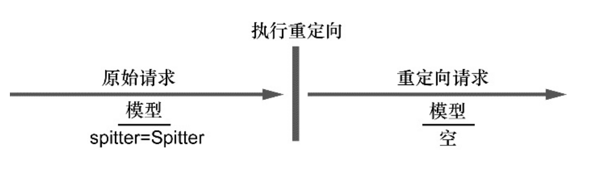

Spring提供了多种方式将异常转换为响应：

* 特定的Spring异常将会自动映射为指定的HTTP状态码；
* 异常上可以添加@ResponseStatus注解，从而将其映射为某一个HTTP状态码；
* 在方法上可以添加@ExceptionHandler注解，使其用来处理异常。

### 将异常映射为HTTP状态码

​												Spring的一些异常会默认映射为HTTP状态码

| Spring异常                              | HTTP状态码                     |
| --------------------------------------- | ------------------------------ |
| BindException                           | 400 - Bad Request              |
| ConversionNotSupportedException         | 500 - Internal Server Error    |
| HttpMediaTypeNotAcceptableException     | 406 - Not Acceptable           |
| HttpMediaTypeNotSupportedException      | 415 - Unsupported Media Type   |
| HttpMessageNotReadableException         | 400 - Bad Request              |
| HttpMessageNotWritableException         | 500 - Internal Server Error    |
| HttpRequestMethodNotSupportedException  | 405 - Method Not AllowedMethod |
| ArgumentNotValidException               | 400 - Bad Request              |
| MissingServletRequestParameterException | 400 - Bad Request              |
| MissingServletRequestPartException      | 400 - Bad Request              |
| NoSuchRequestHandlingMethodException    | 404 - Not Found                |
| TypeMismatchException                   | 400 - Bad Request              |

​             

Spring提供了一种机制，能够通过@ResponseStatus注解将异常映射为HTTP状态码。

实际上，如果出现任何没有映射的异常，响应都会带有500状态码。

###### @ResponseStatus注解：将异常映射为特定的状态码

```java
/**
 * SpittleNotFoundException 将异常映射为HTTP状态404
 */
@ResponseStatus(value = HttpStatus.NOT_FOUND, reason = "spittle not found")
public class SpittleNotFoundException extends RuntimeException {
    private static final long serialVersionUID = 4041289449384074428L;

}
```

###### @ExceptionHandler注解所标注的方法能够处理同一个控制器类中所有处理器方法的异常

###### 使用@ControllerAdvice，为所有的控制器处理异常

控制器通知（controlleradvice）是任意带有@ControllerAdvice注解的类，这个类会包含一个或多个如下类型的
方法：

* @ExceptionHandler注解标注的方法；
* @InitBinder注解标注的方法；
* @ModelAttribute注解标注的方法。

在带有@ControllerAdvice注解的类中，以上所述的这些方法会运用到整个应用程序所
有控制器中带有@RequestMapping注解的方法上。

```java
@ControllerAdvice	//定义控制器类
public class AppWideExceptionHandler {

    @ExceptionHandler(DuplicateSpittleException.class)	//定义异常处理方法
    public String duplicateSpittleHandler() {
        return "erre/duplicate";
    }
}
```

## 跨重定向请求传递数据

一般来讲，当一个处理器方法完成之后，该方法所指定的模型数据将会复制到请求中，并作为请求中的属性，请求会转发（forward）到视图上进行渲染。因为控制器方法和视图所处理的是同一个请求，所以在转发的过程中，请求属性能够得以保存。

当控制器的结果是重定向的话，原始的请求就结束了，并且会发起一个新的GET请求。原始请求中所带有的模型数据也就随着请求一起消亡了。在新的请求属性中，没有任何的模型数据，这个请求必须要自己计算数据。



模型的属性是以请求属性的形式存放在请求中的，在重定向后无法存活

我们可以通过路径变量和/或查询参数的形式传递数据。

* 使用URL模板以路径变量和/或查询参数的形式传递数据；

* 通过flash属性发送数据。

#### 通过URL模板进行重定向

作为占位符填充到了URL模板中，所有的不安全字符都会进行转义。更加安全

```java
@RequestMapping(value = "register", method = RequestMethod.POST)
public String processRegisteration(Spittle spittle, Model model) {
    spittleRepository.save(spittle);
    model.addAttribute("username", spittle.getUsername());
    model.addAttribute("spittleId", spittle.getId());
  	//重定向URL路径将会是“spitterhabuma?spitterId=42”。
    return "reditect:/spittle/{username}"; 
}
```

#### 使用flash属性

Spring3.1提供了通过`Model`的子接口`RedirectAttributes`的`addFlashAttribute()`方法设置flash属性的方法

在重定向执行之前，所有的flash属性都会复制到会话中。在重定向后，存在会话中的flash属性会被取出，并从会话转移到模型之中。


